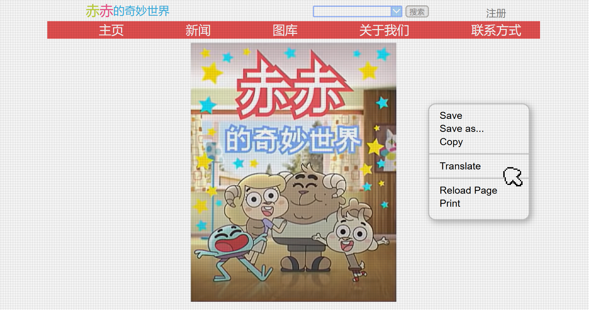

# doppelganger 

[github.com/genderdoog/doppelganger](https://github.com/genderdoog/doppelganger)

## What is this?
This is a recreation of the doppelganger website briefly shown on Gumball's laptop during *The Amazing World Of Gumball* episode "The Copycats" (S5 E12).

[Here](https://www.youtube.com/watch?v=uLxBYzEjeZA&t=13s) is a YouTube clip of that scene. 

## Features
- Fully responsive design that adapts to any screen size.
- Dedicated mobile view designed for a nicer browsing experience on smaller devices.
- Custom cursor and context menu faithfully recreated to match the original website.

## How do I view the website?

### Via Github pages (Recommended)
**[genderdoog.github.io/doppelganger](https://genderdoog.github.io/doppelganger/)**

### Local installation
On desktop and assuming you have Git installed:

1. Clone the repository: `git clone https://github.com/genderdoog/doppelganger.git` 
2. Open the folder: `cd doppelganger`
3. Open `index.html` in any modern web browser.

To open `index.html` via your default:

- Windows: `start index.html`
- MacOS: `open index.html`
- Linux: `xdg-open index.html`

## To do / Future Plans
- [ ] Improve accuracy of font, webpage elements and colours to match original source material.
- [ ] Fix known issues listed on Github Issues.

## Contributing

If you are able to somehow decipher my work, contributions are welcome!

1. Fork the repository and create a new branch for your changes.
2. Submit a pull request with a clear description of your changes.
3. Bug reports, feature requests, and suggestions can be submitted via Issues.

## Credits
- The talent behind *The Amazing World Of Gumball* for the inspiration, assets and TV series. 
- genderdoog for development.

## Tools used during development

### Programs
- [Notepad++](https://notepad-plus-plus.org/)
- [Brave Browser](https://brave.com/)
- [GIMP](https://www.gimp.org/)
- [GitHub Desktop](https://github.com/apps/desktop)

### Websites
- [ChatGPT](https://chatgpt.com/)
- [Google Translate](https://translate.google.com/)
- [JavaScript validation](https://jshint.com/)
- [CSS validation](https://jigsaw.w3.org/css-validator/)
- [HTML validation](https://validator.w3.org/)

## Disclaimer  
This project is a fan-made recreation of the Doppelganger website from *The Amazing World of Gumball*.  
All images and assets from the show belong to their respective copyright holders (Cartoon Network, Warner Bros.).  
This project is for educational and non-commercial purposes only.  
If you are a rights holder and want content removed, please contact me.